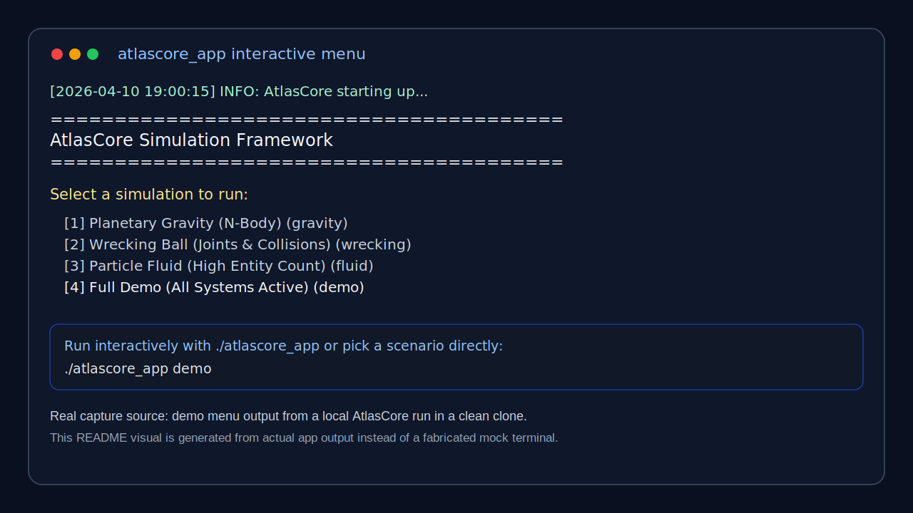
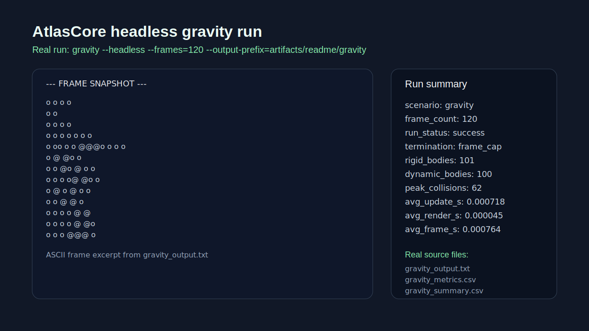
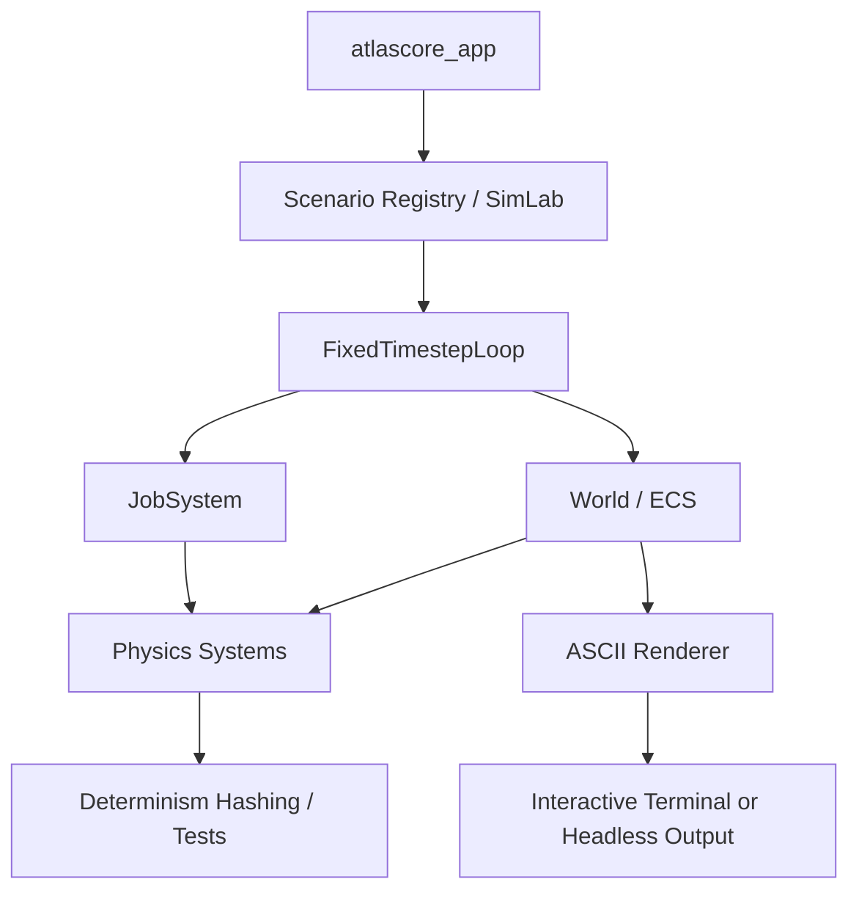

# AtlasCore  [](https://aeml.github.io/atlascore/coverage/) [](https://aeml.github.io/atlascore/)

AtlasCore is a modern C++20 simulation framework for deterministic, testable, systems-heavy experiments across ECS composition, multithreaded job scheduling, fixed-timestep physics, and lightweight ASCII rendering.

## Why this project exists
- Explore engine-style architecture without hiding the interesting parts behind heavyweight dependencies
- Make determinism, scheduling, physics, and scenario-driven testing first-class concerns
- Provide a compact but serious codebase for simulation, concurrency, and systems design work

## Technical highlights
- Multithreaded job scheduling with optional parallel physics/collision phases
- ECS with type-erased component registries and polymorphic system updates
- Deterministic fixed-timestep physics covering integration, collision detection, resolution, and constraints
- Simulation Lab scenarios for demos, headless runs, benchmarks, and determinism hashing
- Extensive self-tests plus CI coverage, sanitizer jobs, and published docs

## What it demonstrates
- concurrency and systems programming
- determinism and testability
- simulation / engine architecture
- shipping discipline beyond toy demos

## Recommended visuals to add
- Terminal capture or GIF of the `demo` scenario running
- Screenshot of headless output or determinism-oriented scenario output
- One architecture image or annotated screenshot showing modules / simulation flow

## Vision and media
- Final vision: [final_vision.md](final_vision.md)
- Planned media folder: [`docs/media/`](docs/media/)

## Preview placeholders



> Replace the placeholder SVG files in `docs/media/` with terminal captures or GIFs from real scenarios. Add an animated capture as `docs/media/demo-loop.gif` when ready.

## System architecture



See [sysarchitecture.md](sysarchitecture.md) for deeper design notes. Module-specific docs live under [docs/](docs/).

## Modules

| Module   | Key Types / Responsibilities |
|----------|------------------------------|
| core     | `Logger`, `Clock`, `FixedTimestepLoop` (stable fixed delta) |
| jobs     | `JobSystem` (worker pool, scheduling, optional parallelization hooks) |
| ecs      | `World`, `ComponentStorage<T>`, `ISystem` polymorphic updates |
| physics  | Components: `TransformComponent`, `RigidBodyComponent`, `DistanceJointComponent`, `EnvironmentForces`, `AABBComponent`, `CircleColliderComponent`; Systems: `PhysicsIntegrationSystem`, `CollisionSystem`, `CollisionResolutionSystem`, `ConstraintResolutionSystem`, `PhysicsSystem` orchestrator |
| ascii    | `TextRenderer` + `Renderer` (terminal diff rendering) |
| simlab   | Scenario registry, hashing tools, built‑in scenarios (see below) |

## Scenarios (SimLab)

Scenario keys (CLI):

```
demo             # Full Demo (All Systems Active)
gravity          # Planetary Gravity (N-Body)
wrecking         # Wrecking Ball (Joints & Collisions)
fluid            # Particle Fluid (High Entity Count)
```

Run interactively (menu-driven) with `./atlascore_app` (no args) or pick a key: `./atlascore_app demo`. Use `--headless` or env `ATLASCORE_HEADLESS=1` for file-based headless exports. Add `--output-prefix=PATH_BASE` to write `PATH_BASE_output.txt`, `PATH_BASE_metrics.csv`, `PATH_BASE_summary.csv`, and `PATH_BASE_manifest.csv` instead of the default `headless_*` files. Add `--batch-index=PATH.csv` to append each run manifest row into a shared batch ledger.

## Directory Structure (Public Headers)

```
include/
  core/      Clock.hpp, FixedTimestepLoop.hpp, Logger.hpp
  jobs/      JobSystem.hpp
  ecs/       World.hpp, ComponentStorage.hpp
  physics/   Components.hpp, Systems.hpp, CollisionSystem.hpp
  ascii/     TextRenderer.hpp, Renderer.hpp
  simlab/    Scenario.hpp (plus registry + hashing in src/simlab)
src/         (module implementations)
tests/       (CTest executables driven by CMake options)
docs/        (module docs + workflows)
```

## Building

Prerequisites: CMake ≥ 3.20, a C++20 compiler (MSVC 17+, Clang, or GCC). Optional: Ninja.

Windows (MSVC):
```powershell
mkdir build
cd build
cmake -G "Visual Studio 17 2022" ..
cmake --build . --config Debug --parallel
```

Linux / macOS (Clang/GCC):
```bash
cmake -S . -B build -DCMAKE_BUILD_TYPE=Debug
cmake --build build --parallel
```

Options:
* `ATLASCORE_BUILD_TESTS=ON|OFF` (default ON)
* `ATLASCORE_ENABLE_COVERAGE=ON` (GNU/Clang only; adds `--coverage -O0 -g -fprofile-update=atomic`)

## Running & CLI

```bash
./atlascore_app                 # interactive menu
./atlascore_app demo            # full demo (pendulum, tower, particles)
./atlascore_app gravity         # specific scenario
./atlascore_app fluid --headless
./atlascore_app demo --headless --frames=300  # auto-quit after 300 frames
./atlascore_app gravity --headless --frames=300 --output-prefix=artifacts/gravity_run
./atlascore_app gravity --headless --frames=300 --output-prefix=artifacts/gravity_run --batch-index=artifacts/batch_index.csv
ATLASCORE_HEADLESS=1 ./atlascore_app wrecking  # env flag alternative
```

Headless output files default to `headless_output.txt`, `headless_metrics.csv`, `headless_summary.csv`, and `headless_manifest.csv` (all overwritten per run). Use `--output-prefix=PATH_BASE` to write `PATH_BASE_output.txt`, `PATH_BASE_metrics.csv`, `PATH_BASE_summary.csv`, and `PATH_BASE_manifest.csv` instead. The per-frame metrics CSV includes frame index, simulated time, world hash, collision count, rigid-body count, dynamic-body count, transform count, update wall time, render wall time, and total frame wall time. The summary CSV now records scenario-selection honesty fields (`requested_scenario_key`, `resolved_scenario_key`, `fallback_used`) plus run config metadata (`fixed_dt_seconds`, `bounded_frames`, `requested_frames`, `headless`, `run_config_hash`), run outcome fields (`run_status`, `failure_category`), and `termination_reason` before the aggregate timing/state fields. `bounded_frames=0` means the run was not frame-capped and `requested_frames` is therefore the sentinel `0`. Current successful termination reasons are `frame_cap`, `unbounded_headless_default`, `user_quit`, and `eof_quit`. Current startup failure categories include `output_open_failed` and `batch_index_open_failed`. When startup fails before the normal artifacts can be opened, AtlasCore falls back to `headless_startup_failure_summary.csv` and `headless_startup_failure_manifest.csv` so automation still gets an honest record. The manifest CSV also records batch-index linkage/status fields: `batch_index_path`, `batch_index_append_status`, and `batch_index_failure_category`. `not_requested` means no batch ledger was requested, `appended` means the manifest row was appended successfully, and `append_failed` means the run itself succeeded but the ledger update did not. The manifest CSV records the same selection/config fingerprint plus frame count, resolved artifact paths, batch linkage, a UTC timestamp, the build git commit, dirty-state flag, and build type so batch runs can be indexed against the exact binary provenance and invocation shape that produced them. If `--batch-index=PATH.csv` is provided, AtlasCore still tries to append the same manifest row into that shared CSV, writing the header only when the file is created/empty.

## Testing

CTest targets (enabled when `ATLASCORE_BUILD_TESTS=ON`) include:

`atlascore_selftests`, `atlascore_determinism_tests`, `atlascore_collision_tests`, `atlascore_determinism_collision_tests`, `atlascore_text_renderer_tests`, `atlascore_text_renderer_extra_tests`, `atlascore_ecs_extra_tests`, `atlascore_ecs_physics_tests`, `atlascore_physics_stability_tests`, `atlascore_physics_circle_broadphase_tests`, `atlascore_simlab_scenarios_tests`, `atlascore_simlab_determinism_tests`, `atlascore_scenario_update_contract_tests`, `atlascore_ecs_collision_tests`, `atlascore_jobs_wait_tests`, `atlascore_scenario_registry_tests`, `atlascore_coverage_tests`.

Run all:
```bash
ctest --output-on-failure
```
Specific target:
```bash
ctest -R AtlasCoreCollisionTests
```

## Determinism

Determinism tests hash full world state (transforms, rigid bodies, AABBs, circle colliders, and joints) and compare repeated runs. `atlascore_simlab_determinism_tests` now runs the built-in scenarios twice and asserts the per-step hash stream matches exactly. Use fixed timestep loop (`1/60s`) to maintain sim stability.

## Coverage (GNU/Clang)

```bash
cmake -S . -B build -DCMAKE_BUILD_TYPE=Debug -DATLASCORE_ENABLE_COVERAGE=ON
cmake --build build --parallel
cd build && ctest --output-on-failure
lcov --directory . --capture --output-file coverage.info
lcov --remove coverage.info '/usr/*' '*/tests/*' --output-file coverage.info
genhtml coverage.info --output-directory coverage-report
```

GitHub Actions publishes Doxygen docs and coverage HTML (`/coverage`).
The CI workflow also runs a dedicated Linux sanitizer job (ASan + UBSan).

## Roadmap (High-Level)

Short term:
* Expand scenario variety (rain, clouds, profiling‑oriented benchmarks)
* Additional physics constraints & joint compliance behaviors
* ECS storage optimization (move toward contiguous / archetype iteration)
* Lightweight profiling overlays through ASCII renderer (HUD + metrics)

Longer term:
* More robust collision shapes (rotated boxes, line segments)
* Parallel solver phases with determinism controls
* Scenario scripting / data export formats beyond headless text

## Contributing

See [docs/contributing.md](docs/contributing.md) and module docs (`docs/*.md`). Please keep changes small, add/extend tests, and preserve deterministic behavior when modifying physics or scheduling.

Project improvement tracking lives in [docs/implementation_backlog.md](docs/implementation_backlog.md).

## License

This project is licensed under the GNU General Public License v3.0. See the [LICENSE](LICENSE) file for details.

## Author

Created by [Robert Mendola](https://mendola.tech)

---
Enjoy exploring AtlasCore – feedback & improvements welcome.
