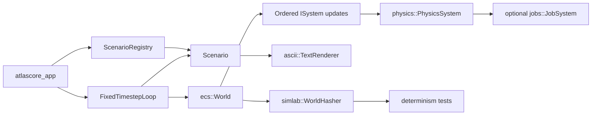

# AtlasCore

AtlasCore is a C++ systems architecture project for building and testing small simulation workloads. In plain English: it is a compact simulation framework with an ECS world, a fixed-step update loop, physics systems, optional ASCII output, and a headless mode for repeatable runs and regression testing.

## Overview

AtlasCore is organized like a small engine-style runtime rather than a single demo program. The codebase is split into focused modules for core timing/logging, ECS state management, physics, a standalone job system, ASCII rendering, and scenario-driven simulation runs.

The main application drives scenarios through a fixed timestep of `1/60` seconds, which makes the update path easier to reason about and test. Built-in scenarios such as `gravity`, `wrecking`, `fluid`, and `demo` exercise the same runtime with different workloads.

## What this demonstrates

- C++20 systems programming with explicit ownership and small module boundaries
- ECS-oriented simulation design with separate entities, components, and systems
- Deterministic update patterns: fixed timestep, ordered system execution, and world-state hashing tests
- Performance-minded design choices such as dense component storage, bounded update catch-up, and optional job dispatch for larger physics workloads
- Maintainability through clear module separation, headless automation hooks, and a broad CTest suite

## Architecture

AtlasCore keeps the runtime pieces separate so simulation code is easy to extend without rewriting the engine loop.



Key modules:

| Module | Role |
| --- | --- |
| `core` | Clock, logging, and fixed-timestep loop |
| `ecs` | Entity IDs, component storage, ordered system updates |
| `physics` | Integration, collision detection, constraint solving, resolution |
| `jobs` | Worker-pool job dispatch used by larger physics passes |
| `simlab` | Scenario registry, headless metrics, world hashing, run orchestration |
| `ascii` | Lightweight terminal rendering for interactive scenarios |

## ECS / simulation model

The ECS centers on `ecs::World`, which owns entities, type-erased component stores, and a list of polymorphic systems. `ComponentStorage<T>` uses dense vectors plus an entity-to-index map, so iteration stays contiguous while lookup and removal remain direct.

Simulation flow is straightforward:

1. A scenario builds an `ecs::World` in `Setup`.
2. The app runs a fixed-step loop at `1/60` seconds.
3. Each tick calls scenario logic, then `world.Update(dt)`.
4. `world.Update(dt)` runs systems in insertion order.
5. Rendering is either interactive ASCII output or headless file export.

The physics pipeline is explicit. `physics::PhysicsSystem` substeps each frame, integrates bodies, syncs broadphase bounds, detects collisions, resolves positions, solves joints, updates velocities, and then resolves collision velocities. When workloads are large enough, integration and collision detection can dispatch batch jobs through `jobs::JobSystem`; the code keeps deterministic behavior in mind by sorting collision work and merging per-task results in order.

Determinism is a first-class concern in the current codebase. `core::FixedTimestepLoop` clamps frame time, bounds catch-up work, and advances the simulation in fixed increments. `simlab::WorldHasher` hashes ECS world state, and the determinism tests rerun built-in scenarios and compare hash streams across identical runs.

## Tech stack

- C++20
- CMake 3.20+
- Standard library threading and synchronization primitives
- CTest for test execution
- GitHub Actions for CI across Linux, macOS, and Windows

## Build instructions

AtlasCore uses CMake and builds a library plus the `atlascore_app` executable.

```bash
cmake -S . -B build -DCMAKE_BUILD_TYPE=Debug -DATLASCORE_BUILD_TESTS=ON
cmake --build build --config Debug --parallel
```

Notes:

- `ATLASCORE_BUILD_TESTS` defaults to `ON`
- `ATLASCORE_ENABLE_COVERAGE=ON` is available for GNU/Clang builds

## Run instructions

Run the app from the repository root:

```bash
./build/atlascore_app
./build/atlascore_app demo
./build/atlascore_app gravity --headless --frames=300
./build/atlascore_app fluid --headless --frames=300 --output-prefix=artifacts/fluid_run
```

Built-in scenario keys in the repo today:

- `gravity`
- `wrecking`
- `fluid`
- `demo`

Headless mode can emit output and metrics artifacts for repeatable runs and automated checks.

## Testing

The repo includes unit-style and scenario-level tests covering ECS behavior, physics behavior, collision behavior, job waiting semantics, scenario registry behavior, headless metrics, and determinism.

Run the test suite with:

```bash
ctest --test-dir build -C Debug --output-on-failure
```

Examples of determinism-focused coverage in the current codebase:

- `AtlasCoreDeterminismTests`
- `AtlasCoreDeterminismCollisionTests`
- `AtlasCoreSimlabDeterminismTests`

## Project status

AtlasCore is an active portfolio-style C++ systems architecture project. The current repository already contains a working ECS, fixed-step simulation loop, modular physics pipeline, standalone job system, headless execution path, and a substantial automated test suite. It reads as an intentionally engineering-focused codebase rather than a one-off demo.
